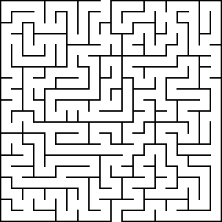
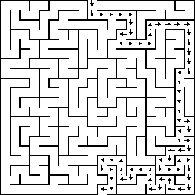

# Maze Escape
Analayzes given maze image and founds the escaping route for exit. Exports maze as png format and visializes route. Input file should be located on root folder and default is `maze1.png`. Image is exported on root folder as `output.png`

## Running With Maven
```
mvn exec:java -Dexec.mainClass="com.mex.mazeescape.main.MazeEscapeApplication"  -Dexec.args="-i ./maze1.png"
```

## Running With Executable jar
```
mvn clean package
java -jar target/MazeEscape-1.0-SNAPSHOT.jar -i ./maze1.png
```

## Help Screen
```
Usage: <main class> [-i=<inputFile>] [COMMAND]
Maze escape application based png image
  -i, --inputFile=<inputFile>
         Path to input file, default value is: ./maze1.png, file should be in
           root folder
Commands:
  help  Displays help information about the specified command
  
```

### Sample Input


### Sample Output

